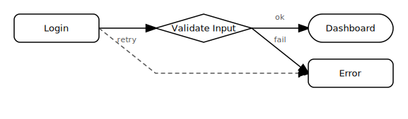

# gph — Graph DSL Specification

`gph` is a Lisp-like DSL that compiles to [Mermaid](https://mermaid.js.org/) flowchart syntax. It prioritizes brevity: no XML, no brackets-for-syntax, no repetitive node declarations.

## Installation

```sh
cargo install --path .
```

## Usage

```sh
gph diagram.gph          # from file
cat diagram.gph | gph    # from stdin
```

Output is Mermaid flowchart text, written to stdout. Errors go to stderr with exit code 1.

---

## Syntax

A `gph` file contains a single `graph` expression.

### Graph root

```lisp
(graph DIRECTION STMT...)
```

`DIRECTION` sets the flow direction:

| Keyword | Meaning |
|---------|---------|
| `lr` | Left → Right |
| `rl` | Right → Left |
| `td` | Top → Down |
| `bt` | Bottom → Top |

---

### Node declaration

```lisp
(ID)                        ; implicit node — no output, just usable in edges
(ID "Label")                ; node with label, default (box) shape
(ID "Label" SHAPE)          ; node with label and explicit shape
```

A node declaration only emits a Mermaid line when it has a label. Nodes referenced in edge chains but never declared are implicit — they appear in the output only via the edge that uses them.

**Shapes:**

| Keyword | Mermaid syntax | Appearance |
|---------|---------------|------------|
| *(default)* | `id[label]` | Rectangle |
| `round` | `id(label)` | Rounded rectangle |
| `diamond` | `id{label}` | Diamond (decision) |
| `stadium` | `id([label])` | Stadium / pill |
| `hex` | `id{{label}}` | Hexagon |
| `sub` | `id[[label]]` | Subroutine |

---

### Edge chain

```lisp
(ARROW ID ID...)            ; chain of edges, no label
(ARROW ID ID... "Label")    ; chain; label applies to the last hop only
```

Two or more node IDs are required. With no label, all hops are emitted on one chained line. With a label, the prefix chain is emitted unlabeled, and only the final hop carries the label.

**Arrow types:**

| Symbol | Mermaid output | Appearance |
|--------|---------------|------------|
| `->` | `-->` | Solid arrow |
| `-->` | `-.->` | Dotted arrow |
| `=>` | `==>` | Thick arrow |
| `-o` | `--o` | Circle endpoint |
| `-x` | `--x` | Cross endpoint |

---

### Comments

`;` begins a comment that runs to end of line.

```lisp
(graph lr
  ; this whole line is ignored
  (-> a b))  ; inline comment
```

---

## Example

```lisp
(graph lr
  (-> (login "Login" round) (validate "Validate Input" diamond))
  (-> validate (dashboard "Dashboard" stadium) "ok")
  (-> validate (error "Error" round) "fail")
  (--> error login "retry"))  ; dotted back-edge
```

Compiles to:

```
flowchart LR
  login("Login")
  validate{"Validate Input"}
  login --> validate
  dashboard(["Dashboard"])
  validate -->|ok| dashboard
  error("Error")
  validate -->|fail| error
  error -.->|retry| login
```



---

## Error messages

Errors include a line and column number:

```
lex error at 3:5: unexpected character '@'
parse error at 2:10: unknown direction 'xx'; expected lr, rl, td, or bt
parse error at 4:3: edge requires at least two nodes, got 1
parse error at 5:1: expected closing ')'
```
