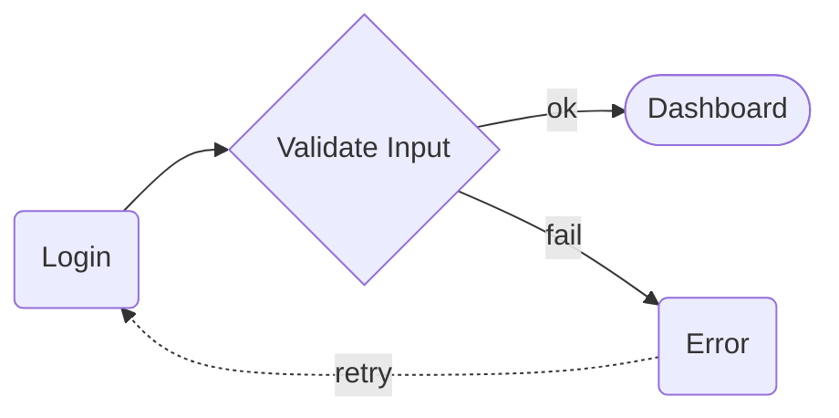

# gph

`gph` is a small, Kitty-native Mermaid previewer. It uses
[merman](https://github.com/Latias94/merman) for parsing, layout, SVG, and PNG
rendering, watches source files for changes, shows a live Kitty image preview, and
renders SVG, PNG, JPEG, and PDF files.

There is no custom diagram language in the CLI, manual node positioning, mouse
interaction, or browser/Node runtime. Mermaid decides all layout. The binary
also contains an experimental, rendering-independent `mml` module for a possible
future shorthand filetype.

## Install

```sh
brew install dfontana/tap/gph
```

Or from source:

```sh
cargo install --path .
```

The crate requires Rust 1.95 or newer. Live previews require Kitty.

## Watch with a live preview

```sh
gph watch diagram.mmd
```

Run the watcher in its own terminal pane and edit the Mermaid file with any editor.
`gph` uses native file-system notifications and debounces a burst of save events
before rerendering. The preview starts below the command's existing terminal
output and grows downward when its pane is resized; it never enters the alternate
screen. Invalid Mermaid leaves the
last valid preview visible and reports the error in the preview border. Press
`Ctrl-C` or `Ctrl-Q` to quit.

## Preview unsaved Helix buffers

In a Kitty pane, start the preview daemon before opening Helix. LSP preview
support is Unix-only because it uses Unix-domain sockets. A single daemon per
user serves every workspace, so you can start it from any directory and connect
from anywhere in the same user session. `gph lsp` stores its socket in a
per-user runtime directory (`XDG_RUNTIME_DIR` on Linux, `~/Library/Caches` on
macOS).

```sh
gph lsp
```

Then add this once to Helix's `languages.toml` (alongside `merman-lsp`):

```toml
[language-server.gph-preview]
command = "gph"
args = ["lsp-connect"]

[[language]]
name = "mermaid"
language-servers = ["merman-lsp", "gph-preview"]
```

Helix starts `gph lsp-connect` automatically for each Mermaid buffer; it bridges
Helix's standard input/output to the shared daemon socket. The daemon shows the
most recently changed open document across every connected workspace and uses only the full unsaved text supplied
by LSP `didOpen` and `didChange` notifications—it never reads the buffer from
disk. Closing a buffer returns the preview to the next most recent open
document, and renders debounce briefly after the final edit. `gph` advertises
LSP full text synchronization (`openClose` and `change = 1`) only, so
`merman-lsp` remains the diagnostics provider. Quit the Kitty preview pane with
`Ctrl-Q` or `Ctrl-C`; the socket is removed and a later Helix connection reports
that `gph lsp` needs to be started again.

## Render files

```sh
gph render diagram.mmd -o diagram.svg
gph render diagram.mmd -o diagram.png
printf 'flowchart TD\nA --> B\n' | gph render - -o diagram.pdf
```

The format is inferred from the `.svg`, `.png`, `.jpg`/`.jpeg`, or `.pdf`
destination extension, or set explicitly with `--format`. Failed rendering never
writes the output. `gph export` remains an alias for `gph render`.

## Scope

- Kitty graphics protocol only; no Sixel, iTerm, or text fallback.
- The CLI accepts Mermaid source only; it has no MML filetype or DSL-conversion
  subcommand.
- Node locations are always generated by Mermaid/merman.

## Cutting a release

Releases are tag-driven. Pushing a `v*` tag runs
[`.github/workflows/release.yml`](.github/workflows/release.yml), which builds
`x86_64-unknown-linux-gnu`, `aarch64-unknown-linux-gnu`, and
`aarch64-apple-darwin`, attaches the tarballs to a GitHub release, and fires a
`gph-release` repository dispatch at `dfontana/homebrew-tap`. The tap regenerates
`Formula/gph.rb` from the published assets. Nothing is hand-edited downstream.

1. Bump `version` in `Cargo.toml`, then build once so `Cargo.lock` picks up the
   new version. Commit both files.

2. Push `main`:

   ```sh
   jj bookmark set main -r @-
   jj git push
   ```

3. Tag the release commit. **jj cannot create git tags** — a jj bookmark pushes
   to `refs/heads/*`, which will not match the workflow's `tags: ["v*"]`
   trigger — and the `no-git.sh` hook blocks raw `git tag`. Create the tag ref
   through the API instead, which produces the same push event:

   ```sh
   gh api repos/dfontana/gph/git/refs \
     -f ref=refs/tags/v0.2.0 \
     -f sha="$(jj log -r @- --no-graph -T commit_id)"
   ```

4. Watch the build and confirm the tap picked it up:

   ```sh
   gh run watch "$(gh run list --repo dfontana/gph --limit 1 --json databaseId --jq '.[0].databaseId')" --exit-status
   gh run list --repo dfontana/homebrew-tap --limit 1
   ```

5. Verify rather than trusting the green check — confirm the published
   checksums match the assets and that the released binary runs, since the
   formula's `test do` block executes `gph --help`:

   ```sh
   gh release download v0.2.0 --repo dfontana/gph --dir /tmp/gph-verify
   sha256sum /tmp/gph-verify/*.tar.gz
   gh api repos/dfontana/homebrew-tap/contents/Formula/gph.rb --jq .content | base64 -d
   ```

If the dispatch never arrives, the tap also runs a nightly backstop, and the
formula can be regenerated by hand from the tap repo with
`scripts/gen-gph-formula.sh v0.2.0`.

Note that the formula's `desc` string lives in the tap's
`scripts/gen-gph-formula.sh`, not in this repo — changing this project's
description does not propagate on its own.

## Experimental MML syntax

The internal `src/mml` module is a rendering-independent, Lisp-like DSL for a
deliberately small Mermaid flowchart subset. It provides parsing plus MML ↔
Mermaid conversion without using any rendering code. MML-to-Mermaid is supported
for every valid MML graph.
Mermaid-to-MML is intentionally strict: it succeeds only for the subset MML can
represent and rejects unknown or lossy Mermaid syntax instead of silently
skipping it.

An MML document contains one graph expression:

```lisp
(graph DIRECTION STMT...)
```

| Direction | Meaning |
| --- | --- |
| `lr` | Left → Right |
| `rl` | Right → Left |
| `td` | Top → Down |
| `bt` | Bottom → Top |

### Nodes

```lisp
(ID)                        ; implicit node — usable by edges
(ID "Label")                ; labelled box
(ID "Label" SHAPE)          ; labelled node with a shape
```

A node declaration emits Mermaid only when it has a label. Nodes used only in
edges are implicit.

| Shape | Mermaid form | Appearance |
| --- | --- | --- |
| *(default)* | `id["label"]` | Rectangle |
| `round` | `id("label")` | Rounded rectangle |
| `diamond` | `id{"label"}` | Diamond |
| `stadium` | `id(["label"])` | Stadium / pill |
| `hex` | `id{{"label"}}` | Hexagon |
| `sub` | `id[["label"]]` | Subroutine |

### Edge chains

```lisp
(ARROW ID ID...)            ; chain with no label
(ARROW ID ID... "Label")    ; label applies only to the last hop
```

An edge requires at least two IDs. To keep declarations close to their use, an
edge may use an inline node declaration wherever it accepts an ID:

```lisp
(-> (login "Login" round) (check "Check" diamond))
```

| Arrow | Mermaid output | Appearance |
| --- | --- | --- |
| `->` | `-->` | Solid arrow |
| `-->` | `-.->` | Dotted arrow |
| `=>` | `==>` | Thick arrow |
| `-o` | `--o` | Circle endpoint |
| `-x` | `--x` | Cross endpoint |

### Strings and comments

Strings accept `\"`, `\\`, `\n`, and `\t` escapes. `;` starts a comment that
runs to the end of its line.

```lisp
(graph lr
  ; this whole line is ignored
  (-> start finish "done")) ; so is this suffix
```

### Example

```lisp
(graph lr
  (-> (login "Login" round) (validate "Validate Input" diamond))
  (-> validate (dashboard "Dashboard" stadium) "ok")
  (-> validate (error "Error" round) "fail")
  (--> error login "retry"))
```

This becomes:


```mermaid
flowchart LR
  login("Login")
  validate{"Validate Input"}
  login --> validate
  dashboard(["Dashboard"])
  validate -->|ok| dashboard
  error("Error")
  validate -->|fail| error
  error -.->|retry| login
```
